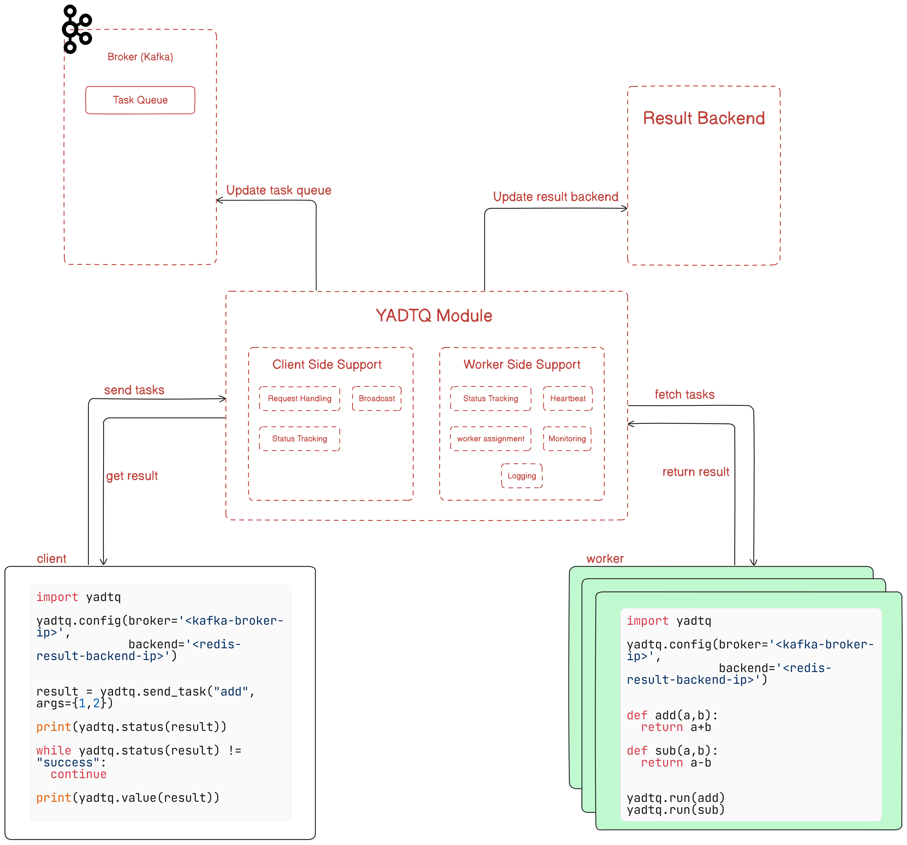

# YADTQ: Yet Another Distributed Task Queue
A Distributed Task Queue that co-ordinates between multiple workers in a highly distributed setup. This system will use Kafka as a communication service

**Running the System**

To run the system, follow these steps:

### Worker Node
From the `scripts` folder, execute:
```bash
./run_worker.sh
```
Alternatively, from the terminal:
```python
python3 -m worker.worker
```
### Client Node
From the `scripts` folder, execute:
```bash
./run_client.sh
```
Alternatively, from the terminal:
```python
PYTHONPATH=. python3 client/client.py
```
**Kafka Broker (Optional)**
To run the Kafka broker, execute:
```python
PYTHONPATH=. python3 core/kafka_broker.py
```
**System Overview**



**Task Structure in Kafka Queue**

The following is an example of a task structure in the Kafka queue:
```json
{
  "task-id": "d5750c0e-ed82",
  "task": "add",
  "args": [1, 2]
}
```
**Result Backend Structure**

The result backend structure is as follows:
```json
{
  "<unique-task-id>": {
    "status": "success",
    "result": "3"
  }
}
```
**Client Side Support**

### Request Handling

When a client submits a task, a unique ID is generated on the client-side before the task is placed onto the Kafka queue. This unique ID is also stored in the result backend with an initial status of "queued". The unique ID allows the client to query the status of the task and retrieve the result once the task has been successfully executed.

### Status Tracking

When a client queries the status of a task, the system checks the result backend using the unique request ID and returns the current status. If the task has been executed successfully, the result is also included in the response to the client.

**Worker Side Support**

### Worker Assignment

A robust logic is developed for assigning tasks to workers, ensuring:

1. **Load Balancing**: Load is distributed evenly among all active workers.
2. **Fault Tolerance**: The system is fault-tolerant, ensuring tasks are reassigned or handled appropriately if a worker node fails during task execution.
3. **Exactly Once Execution**: Tasks are executed exactly once, unless a worker fails during execution and the task is incomplete, necessitating reprocessing. This is the most important requirement that has to be followed.

### Task Status Updates

Workers are responsible for updating the status of tasks as they progress through execution. Upon receiving a task from the Kafka broker, the worker updates the task's status in the result backend to "processing". Once the task execution is completed, the worker updates the status to either "success" (if the task is completed successfully) or "failed" (if an error occurs), along with storing any result or error information. This ensures that clients can accurately track the current status and outcome of their tasks.

### Heartbeat

Workers send periodic heartbeats back to the YADTQ server at regular intervals, allowing the system to keep track of active worker nodes and their health status.

**Optional Features**

### Logging

The YADTQ server generates detailed log files, capturing information such as:

* Connection status to the Kafka broker.
* Task events: including task receipt, task initiation, success, and failure.
* Worker events: including worker connections and disconnections, as well as worker failures.

### Monitoring and Reporting

The system implements a monitoring service with the following components:

* **List of tasks in queue**: Display all tasks currently waiting for execution.
* **List of tasks in progress**: Show tasks that are currently being executed by the workers.
* **Worker statistics**: Track the number of active workers, along with the total number of tasks each worker has executed.
* **Worker failure history**: Log and display information on any previously failed workers, including the timestamp of their last heartbeat.
This monitoring service can be implemented either as a CLI display or as a web UI, but the key requirement is that the data must reflect live, real-time updates.